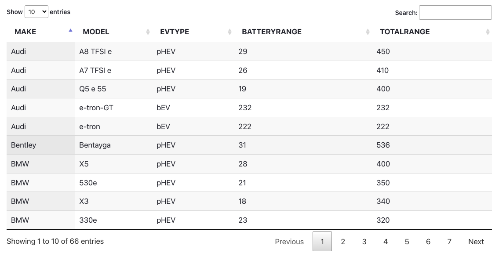
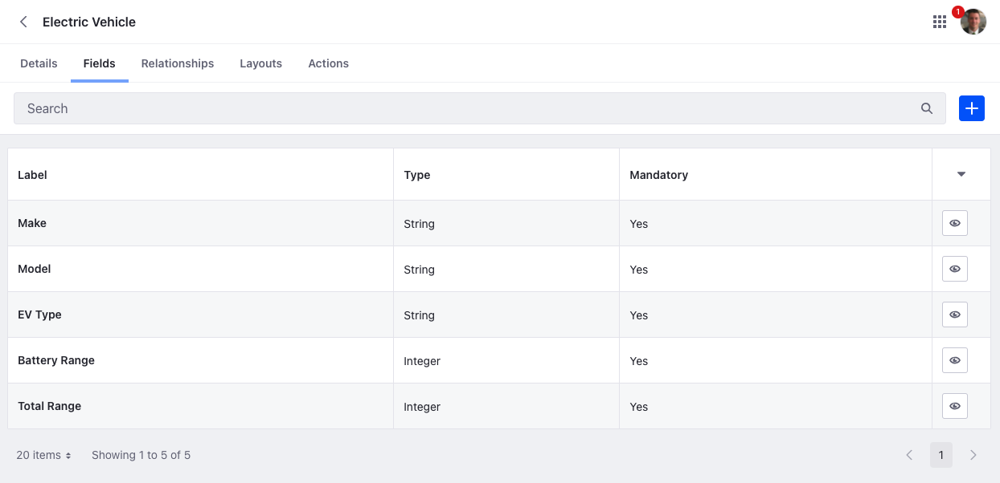
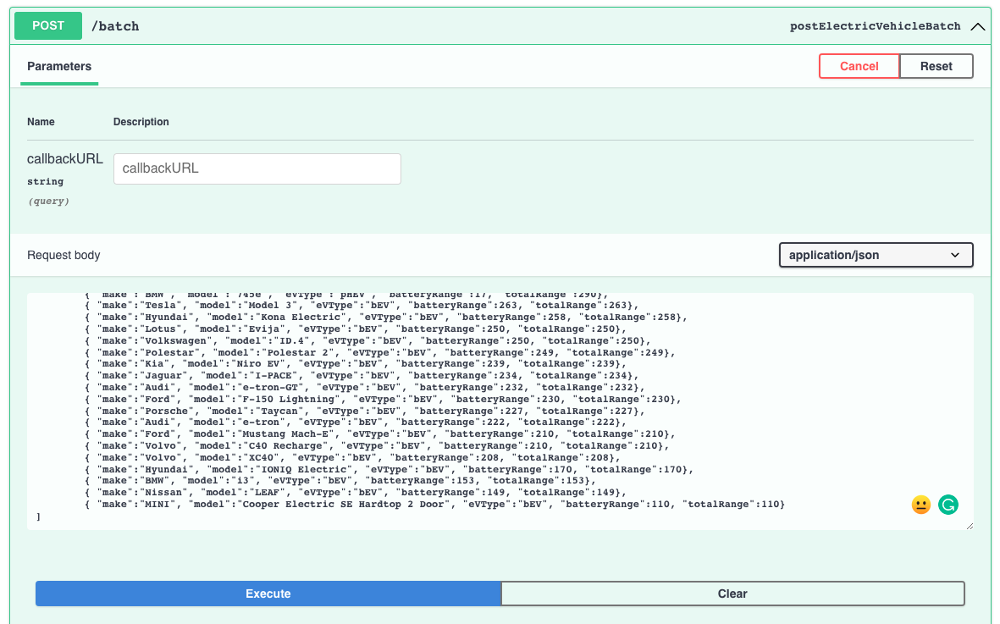
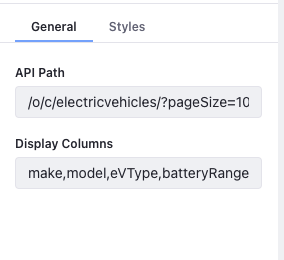

# Sortable Data Table Fragment for Liferay Objects

It is a very common ask for teams to want to show data in a sortable and filterable data table. Using Liferay Objects, Fragments, and Liferay's Headless API teams can quickly make fully functional systems that are more powerful and require less customization than ever before!

Here is a good example with complete fragment code to get you started.

Liferay continues to invest in features that make low-code development possible. Using Liferay Objects, Collections, Forms, and Fragments, teams can quickly make fully functional systems that are more powerful and require less customization than ever before! Liferay Objects are automatically integrated with other Liferay Frameworks like Workflow, Permissions, Asset so that they can be immediately used alongside any out-of-the-box capabilities. 

*Let’s build great things together!!*

# 7.4 Setup

## Liferay Object 

1. Create Electric Vehicle Object (Example: Feel free to build an object structure that suits your needs) 

2. Object Needs the Fields

| Field             | Type                 | Required  |
| :---              |      :----:          |  :----:   |
| Make		        | String               | Yes       |
| Model			    | String               | Yes       |
| EV Type	        | String (or picklist) | Yes       |
| Battery Range     | Integer              | Yes       |
| Total Range     	| Integer              | Yes       |

3. Finish publishing your new object with in company scope. 

## Load content

Load content. Loading many records quickly is easy to do using the headless api's bulk endpoint. <a href="./assets/bulk-data.json" target="_blank">Example data can be found here</a> for the Electric Vehicle example object.

## jQuery Configuration

*Note: Current version required jquery for event handling, dom traversal, and dropdown behavior.*

Enable jQuery in "System Settings" > "Third Party" > "jQuery"

## Build Fragment Bundle

Navigate to the downloaded collection and run the following command. Alternatley, download the compressed zip it from <a href="./assets/datatable-from-objects.zip" target="_blank">here</a>.

npm run compress

Import /liferay-objects-data-table/build/liferay-fragments.zip into site fragments.

## Page Setup

* Add the "Datatable from Objects" fragment to page

* Configure your datasource and columns in the sidebar.

## Contribute! 

Would love to hear comments and suggestions to make it better or provide more options!
